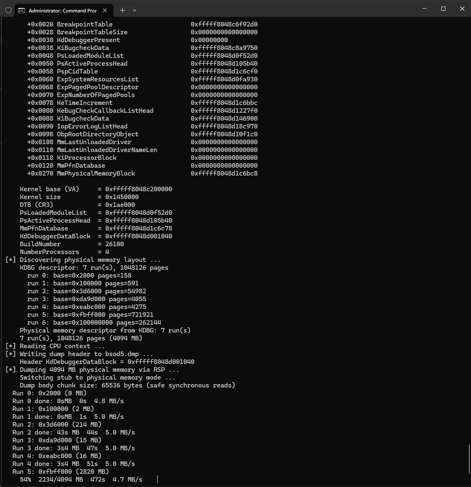

# gdb2dmp

This is a Python script. It converts a Windows x64 virtual machine with a GDB remote stub into a full kernel dump that can be loaded by WinDbg.



## Usage

```bash
python gdb2dmp.py -o snapshot.dmp --target 127.0.0.1:8864
```

## How it works

- Connect to the GDB remote target.
- Read the context and memory of the virtual machine.
- Search for the kernel base and **KdDebuggerDataBlock** to build the dump header.
- Read the physical memory layout from **MmPhysicalMemoryBlock**, then write dump file.

## Requirements
- A Windows x64 virtual machine with a GDB remote stub.
- The GDB stub must support `monitor` features.